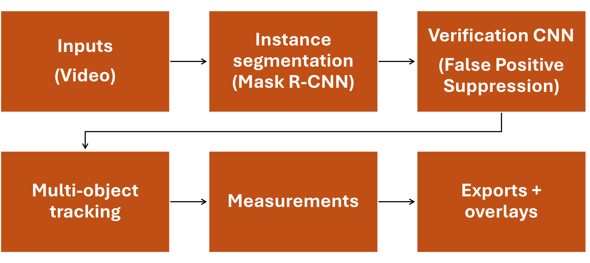
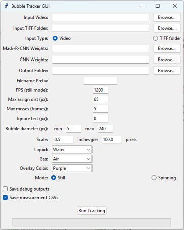
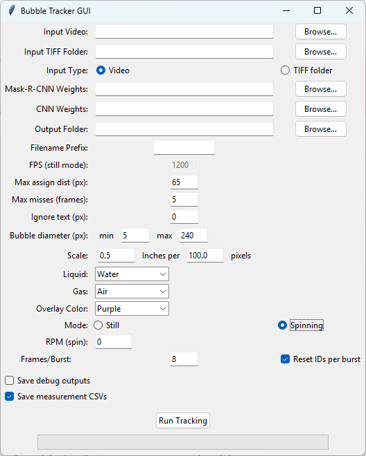
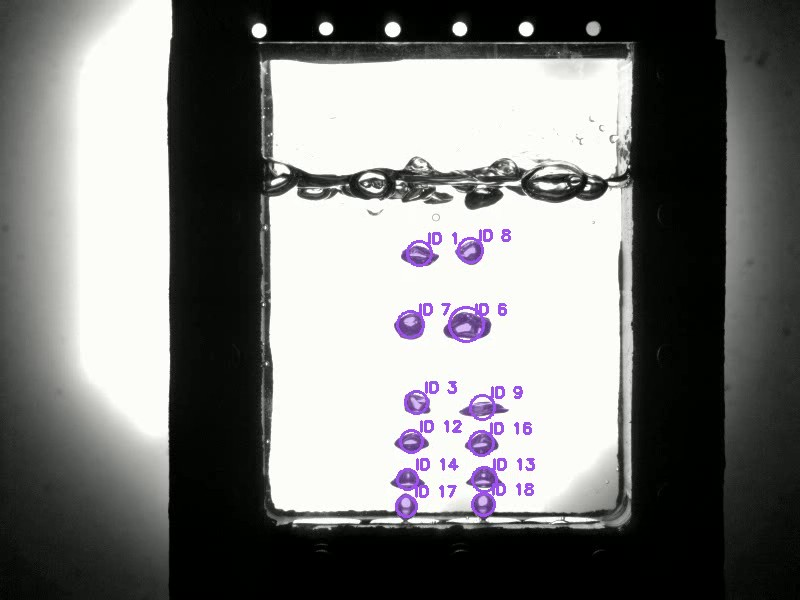
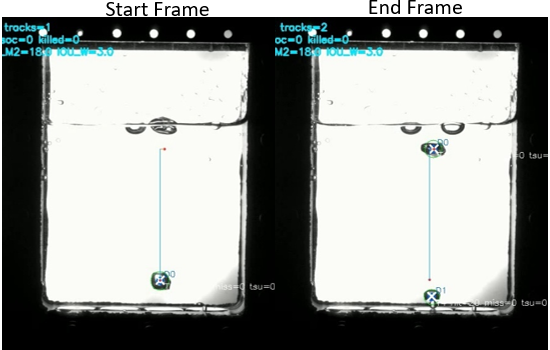

# Bubble Evaluation Tool

Computer vision software for automated bubble detection, tracking, and measurement from CNTR experimental imagery.

Developed by Olivia Williams  
University of Alabama in Huntsville  
Propulsion Research Center

---

## Overview

The Bubble Evaluation Tool combines:

- Detectron2 Mask R-CNN bubble segmentation
- CNN-based detection verification
- Kalman filter multi-object tracking
- Video annotation and CSV export
- Dimensionless parameter calculations
- Experimental spinning-apparatus support

The software supports both standard still-mode experiments and rotating-apparatus experiments.

---

## Repository Index

- [Thesis Materials](Thesis/)
- [Software](Software/)
- [Models](Models/)
- [Documentation](Documentation/)
- [Figures](Figures/)
- [Sample Data](Sample_Data/)

---

## Main Features

- Video and TIFF sequence processing
- Bubble detection and segmentation
- Bubble verification using CNN classification
- Multi-object tracking
- Physical scaling and velocity calculations
- Dimensionless parameter calculations
- Annotated video export
- CSV export
- Debug visualization tools
- Experimental spinning mode support

---

## Repository Structure

### [Thesis Materials](Thesis/)
Contains the thesis PDF. The defense presentation is not included because the file exceeds GitHub's standard file-size limit.

### [Software](Software/)
Contains the main Bubble Evaluation Tool source code and Jupyter notebooks.

### [Models](Models/)
Contains model configurations, CNN weights, and README files explaining where large Mask R-CNN weights should be placed locally.

### [Documentation](Documentation/)
Contains installation instructions, user guide, spinning-mode notes, and thesis cross references.

### [Figures](Figures/)
Contains workflow diagrams, GUI screenshots, and representative segmentation/tracking examples.

### [Sample Data](Sample_Data/)
Contains a small representative input video and example output files for demonstration.

---

## Documentation

- [User Guide](Documentation/user_guide.md)
- [Installation Guide](Documentation/installation_guide.md)
- [Thesis Cross Reference](Documentation/thesis_cross_reference.md)
- [Spinning Mode Notes](Documentation/spinning_mode.md)
- [Sample Data Notes](Sample_Data/README.md)

---

## Thesis Cross Reference

The repository contents are mapped to the corresponding thesis sections here:

[Documentation/thesis_cross_reference.md](Documentation/thesis_cross_reference.md)

---

## Example Outputs

### Processing Workflow

### GUI – Still Mode

### GUI – Spinning Mode

### Example Segmentation Output

### Example Tracking Output

---

## Notes

Large Mask R-CNN model weight files are not included due to GitHub file size limitations. The required model folders contain README files explaining where local model weights should be placed.

The spinning-mode functionality is an experimental extension beyond the primary thesis methodology.